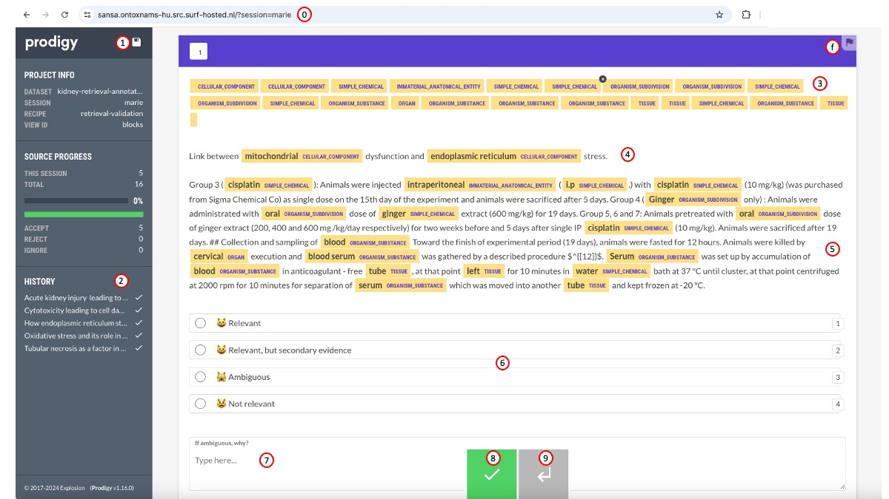

---
output:
  pdf_document: default
  html_document: default
---
# Instructions to use Prodigy to annotate relevance of text

## Prodigy - the interface

  
  
 - 0: url for annotation. Ends with "?session=yourusername".
 - 1: save button. Prodigy save automatically every 10 examples, but make sure to click the button before you close your browser or are away not to lose intermediate work.
 - 2: examples annotated during the session.
 - 3: type of entities present in the passage to examine. They should be in order of the text.
 - 4: question which the passage of text should answer.
 - 5: passage of text, with biomedical entities annotated.
 - 6: relevance of text to answer the question (pick only one).
 - 7: free text box. Use only if you have selected "ambiguous", to explain why.
 - 8: accept button. Move to the next example.
 - 9: undo button. Go back to the previous example. Note that if you hit save you cannot undo.
 - f: flag button. Keep for later review.

## Evaluating relevance

 - **Relevant**: if there is direct evidence pertaining to the question asked.
 
 - **Relevant, but secondary evidence**: if the evidence is relevant but comes from a citation of another paper.
 
 - **Not relevant**: if there is no evidence pertaining to the question. If the text obviously comes from materials section.
 
 - **Ambiguous**: to be defined.
